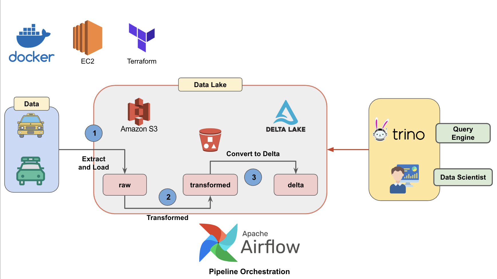

# Airflow Data Insgestion Pipeline

## Architecture


## Tasks
- [x] Design overall data pipeline architecture
- [x] Define and configure Airflow DAG for orchestration
    - [x] Extract and load raw taxi data to Amazon S3
    - [x] Transform raw data into structured format
    - [ ] Convert transformed data to Delta format
    - [ ] Persist transformed data to PostgreSQL
- [ ] Configure Trino to connect to Delta Lake on S3
- [ ] Manage infrastructure with Terraform modules
    - [x] Provision Amazon S3 bucket
    - [ ] Provision EC2 instance
- [ ] Set up CI for Pull Requests (e.g., GitHub Actions)

## Pipeline

## Prequisites

## Setup Infrastructures

### 1. Setup Python Environment
```bash
make install
```

## Troubeshoot

```bash
    - ./.env:/opt/airflow/.env
    ~> dotenv_path = Path(__file__).resolve().parent.parent.parent / ".env"
```

s3fs module not found
```bash
pip uninstall aiobotocore
pip install --upgrade botocore boto3 s3fs
```

## References
- [Querying S3 Object Stores using Trino](https://https://medium.com/@maheshbhatm/querying-s3-object-stores-using-trino-312d82b5145f)